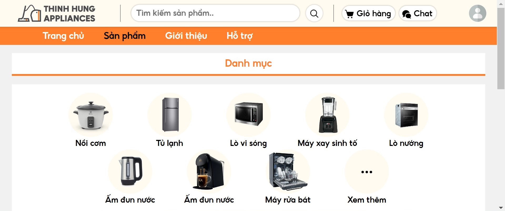
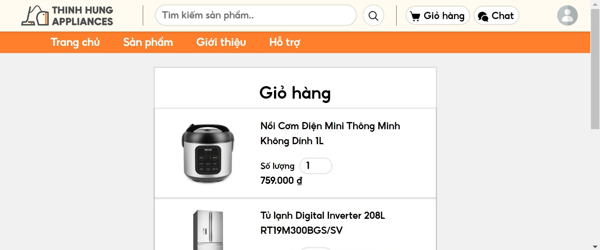

# 🛒 Appliance E-Commerce Website

A responsive front-end website for an online appliance store, designed to showcase products, view shopping carts, and handle user authentication flows like sign up and sign in. This project focuses on clean design, smooth navigation, and basic JavaScript interactions.

## ✨ Key Components

- **Home Page:** Highlights featured products with clear layouts 
- **Product Listing:** Browse products and categories.
- **Product Detail:** View individual product information and details.
- **Shopping Cart:** View items and adjust quantity.
- **User Authentication:** Sign up and sign in with basic form handling.
- **About Page:** Information about the store.

---

## 🖼️ Interface Overview

### Home Page  

### Product Page  

### Detail Page  

### Sign In Page  

### Sign Up Page  

### Cart Page  

### About Page  

---

## 🧩 Technologies Used

- **HTML5**
- **CSS3**
- **JavaScript**

---
